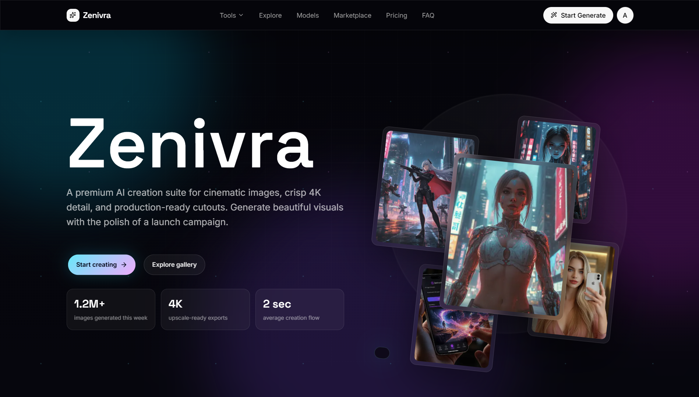
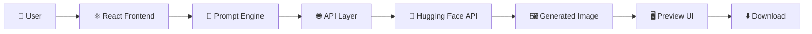
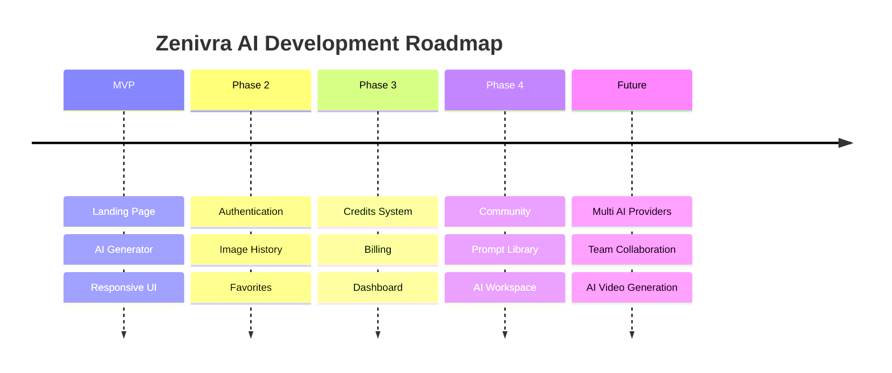

<div align="center">

# 🚀 Zenivra AI

### Transform Your Ideas into Stunning AI-Generated Images

<p align="center">

Create breathtaking AI-generated artwork in seconds using powerful image generation models, wrapped in a modern, fast, and beautifully crafted SaaS experience.

Built with ❤️ using React, TypeScript, Vite, Tailwind CSS and modern web technologies.

</p>

<br>

<p align="center">

<a href="https://zenivra-ai.vercel.app/">

</a>

<a href="https://github.com/naved574/Img-Generator-app">

</a>

</p>

<br>



<br><br>


<br><br>


</div>

---

# ✨ Welcome to Zenivra

Zenivra AI is a modern AI-powered image generation platform crafted to deliver a premium creative experience for designers, developers, creators, and AI enthusiasts.

Instead of building just another AI image generator, Zenivra focuses on combining cutting-edge AI capabilities with a polished SaaS-inspired interface that feels fast, intuitive, and visually engaging.

Whether you're generating concept art, illustrations, wallpapers, marketing assets, or creative experiments, Zenivra provides an elegant environment where creativity meets modern web engineering.

---

# 🌟 Why Zenivra?

Unlike traditional image generators that prioritize functionality over experience, Zenivra is designed with equal attention to performance, usability, accessibility, and aesthetics.

Every interaction is carefully crafted to provide a smooth, delightful, and professional workflow—from entering a prompt to viewing the final generated image.

The goal is simple:

> **Make AI image generation feel effortless, modern, and enjoyable.**

---

# 💎 Highlights

- 🎨 AI-powered text-to-image generation
- ⚡ Fast and responsive interface
- 🌙 Beautiful dark mode experience
- 📱 Mobile-first responsive design
- ✨ Premium SaaS-inspired UI
- 🚀 Smooth animations with Framer Motion & GSAP
- 🧩 Modular and scalable architecture
- 🔒 Ready for authentication & user management
- 📂 Clean and maintainable codebase
- 🌐 Deployment-ready for modern hosting platforms

---

# 🎯 Vision

Zenivra is more than a demo project.

It is being built as a scalable foundation for a complete AI creative platform where users can generate, manage, organize, and enhance AI-generated content through a premium web experience.

The long-term vision includes support for multiple AI providers, user accounts, prompt libraries, image history, collaboration features, subscriptions, and a growing ecosystem of AI-powered creative tools.

---

# 📸 Preview

> Replace these images with actual screenshots from your project.

| Home | Image Generator |
|------|-----------------|
|  |  |

<br>

| Generated Image | Mobile View |
|-----------------|-------------|
|  |  |

---

# 📚 Table of Contents

- Overview
- Features
- Screenshots
- Demo
- Tech Stack
- Architecture
- Project Structure
- Installation
- Environment Variables
- Usage
- API Documentation
- Performance
- Deployment
- Roadmap
- Contributing
- License
- Author

---

# ⚡ Quick Links

| Resource | Link |
|----------|------|
| 🌐 Live Demo | https://zenivra-ai.vercel.app/ |
| 💻 Repository | https://github.com/naved574/Img-Generator-app |
| 📄 License | MIT |
| 🚀 Status | Active Development |

---

---

# ✨ Core Features

<p align="center">
  Powerful AI capabilities wrapped inside a modern, premium, and intuitive user experience.
</p>

<br>

<table>
<tr>

<td width="50%">

### 🎨 AI Image Generation

Transform your ideas into high-quality AI-generated artwork using simple natural language prompts.

**Highlights**

- Text-to-Image Generation
- High-Quality Output
- Creative Prompt Support
- Fast Processing
- AI Model Ready

</td>

<td width="50%">

### ⚡ Lightning Fast Experience

Built with modern technologies to deliver a smooth and responsive experience.

**Highlights**

- Vite Powered
- Optimized Rendering
- Lazy Loading
- Smooth Navigation
- Instant UI Feedback

</td>

</tr>

<tr>

<td>

### ✨ Premium User Interface

Designed with a modern SaaS aesthetic inspired by industry-leading AI platforms.

**Highlights**

- Glassmorphism Elements
- Clean Layout
- Beautiful Typography
- Smooth Animations
- Elegant Components

</td>

<td>

### 📱 Fully Responsive

A consistent experience across every screen size.

**Supports**

- Desktop
- Laptop
- Tablet
- Mobile

</td>

</tr>

<tr>

<td>

### 🌙 Dark Experience

Designed primarily for creators who spend long hours working.

**Features**

- Dark Theme
- Comfortable Contrast
- Modern Color Palette
- Better Accessibility

</td>

<td>

### 🧩 Scalable Architecture

Built with maintainability and future expansion in mind.

**Includes**

- Modular Components
- Reusable UI
- Organized Structure
- Easy Maintenance

</td>

</tr>

</table>

---

# 🚀 AI Generation Workflow

```text
        ✍️ User Prompt
               │
               ▼
      Prompt Validation
               │
               ▼
      AI Generation Engine
               │
               ▼
     Image Processing Layer
               │
               ▼
      Optimized Image Output
               │
               ▼
       Preview & Download
```

---

# 🖼 Application Preview

## 🏠 Landing Page

<p align="center">


</p>

> Premium landing page with smooth animations, modern layout, and SaaS-inspired design.

---

## 🎨 AI Image Generator

<p align="center">


</p>

> Generate AI images using natural language prompts with an intuitive interface.

---

## 🖼 Generated Results

<p align="center">


</p>

> High-quality AI-generated images with a clean preview experience.

---

## 📱 Mobile Experience

<p align="center">


</p>

Responsive design optimized for all screen sizes.

---

<!-- # 🎥 Product Demo

> Replace the image below with a GIF or MP4 preview of your application.

<p align="center">


</p>

--- -->

# 🎯 Perfect For

<table>

<tr>

<td>🎨 Digital Artists</td>
<td>Create concept art and illustrations.</td>

</tr>

<tr>

<td>🧑‍💻 Developers</td>
<td>Generate creative assets for web applications.</td>

</tr>

<tr>

<td>📢 Marketing Teams</td>
<td>Create eye-catching promotional graphics.</td>

</tr>

<tr>

<td>📝 Content Creators</td>
<td>Generate unique visuals for blogs and social media.</td>

</tr>

<tr>

<td>🎓 Students</td>
<td>Experiment with AI-generated creative projects.</td>

</tr>

</table>

---

# ⭐ Why Choose Zenivra?

| Traditional Image Generator | Zenivra AI |
|-----------------------------|------------|
| Basic User Interface | ✅ Premium SaaS UI |
| Limited Experience | ✅ Smooth & Interactive UX |
| Minimal Animations | ✅ Framer Motion + GSAP |
| Generic Layout | ✅ Modern Design System |
| Hard to Scale | ✅ Modular Architecture |
| Desktop Focused | ✅ Fully Responsive |
| Basic Styling | ✅ Beautiful Visual Identity |

---

# 💡 Built With Modern User Experience Principles

Zenivra is designed around the belief that **great AI products should feel effortless to use**.

Every interaction—from entering a prompt to viewing the generated image—has been carefully considered to create a smooth, intuitive, and enjoyable experience.

Instead of overwhelming users with complexity, Zenivra emphasizes clarity, speed, accessibility, and visual polish, making AI creativity approachable for everyone.

---

# 📈 Current Project Status

| Feature | Status |
|----------|--------|
| Landing Page | ✅ Completed |
| Image Generation UI | ✅ Completed |
| Responsive Design | ✅ Completed |
| Modern Animations | ✅ Completed |
| Dark Theme | ✅ Completed |
| Image Preview | ✅ Completed |
| Authentication | 🚧 In Progress |
| Image History | 📅 Planned |
| Credits System | 📅 Planned |
| Billing & Subscription | 📅 Planned |

---

---

# 🛠️ Tech Stack

Zenivra AI is built using a modern web technology stack focused on performance, scalability, maintainability, and developer experience.

## Frontend

| Technology | Purpose |
|------------|---------|
| ⚛️ React | Component-based UI library |
| 🟦 TypeScript | Type-safe development |
| ⚡ Next | Lightning-fast development & build tool |
| 🎨 Tailwind CSS | Utility-first styling |
| 🎬 Framer Motion | UI animations |
| ✨ GSAP | Advanced motion & interactions |
| 🔥 Lucide React | Beautiful modern icons |

---

## Backend (Current / Future)

| Technology | Purpose |
|------------|---------|
| 🟢 Node.js | Runtime Environment |
| 🚂 Express.js | REST API |
| 🍃 MongoDB | Database |
| 🧩 Mongoose | ODM |
| 🔐 JWT | Authentication |
| 🔑 bcrypt | Password Hashing |

---

## AI Services

| Provider | Purpose |
|----------|---------|
| 🤗 Hugging Face | AI Image Generation |
| 🤖 OpenAI | Future AI Features |
| 🔌 Provider Abstraction | Easy multi-model support |

---

# 🏗️ System Architecture



---

# 📂 Project Structure

```text
Img-Generator-app/
│
├── public/
│
├── backend/
│
├── src/
│   │
│   ├── app/
│   │
│   ├── assets/
│   │
│   ├── components/
│   │   ├── app/
│   │   ├── auth/
│   │   ├── landing/
│   │   ├── site/
│   │   └── ui/
│   │
│   ├── data/
│   │
│   ├── features/
│   │
│   ├── hooks/
│   │
│   ├── store/
│   │
│   ├── lib/  
│   │
│   ├── utils/
│   │
│   ├── types/
│   │
│   ├── styles.css
│   ├── App.tsx
│   └── main.tsx
│
├── .env.example
├── package.json
├── next.config.ts
├── tsconfig.json
└── README.md
```

---

# 📦 Application Modules

| Module | Description |
|---------|-------------|
| 🏠 Landing | Marketing homepage |
| 🎨 Generator | AI image generation interface |
| 🖼️ Preview | Generated image preview |
| 📱 Responsive UI | Mobile-first layout |
| 🎬 Animation | Motion & interaction system |
| 🔧 Utilities | Shared helper functions |
| 📂 Assets | Images, icons & static files |

---

# 🚀 Getting Started

## Clone Repository

```bash
git clone https://github.com/naved574/Img-Generator-app.git
```

Move into the project directory.

```bash
cd Img-Generator-app
```

Install dependencies.

```bash
npm install
```

Start the development server.

```bash
npm run dev
```

Build for production.

```bash
npm run build
```

Preview the production build.

```bash
npm run preview
```

---

# ⚙️ Environment Variables

Create a `.env` file in the project root.

```env
VITE_API_BASE_URL=http://localhost:5000

VITE_HUGGINGFACE_API_KEY=your_api_key

VITE_OPENAI_API_KEY=your_api_key
```

> Never commit API keys or secrets to your repository.

---

# 📡 API Integration

## Generate Image

```http
POST /api/generate-image
```

### Request Body

```json
{
  "prompt": "A futuristic cyberpunk city at night",
  "style": "realistic",
  "size": "1024x1024"
}
```

### Successful Response

```json
{
  "success": true,
  "imageUrl": "https://example.com/generated-image.png"
}
```

### Error Response

```json
{
  "success": false,
  "message": "Unable to generate image."
}
```

---

# 🔄 Application Flow

```text
User Prompt
      │
      ▼
Prompt Validation
      │
      ▼
API Request
      │
      ▼
AI Model
      │
      ▼
Generated Image
      │
      ▼
Image Preview
      │
      ▼
Download / Share
```

---

# 🎯 Design Principles

Zenivra follows a set of engineering principles to keep the project maintainable and scalable.

- Component-driven architecture
- Reusable UI components
- Clean separation of concerns
- Type-safe development
- Consistent file organization
- Responsive-first design
- Performance-focused rendering
- Accessibility-conscious interface
- Easy feature expansion
- Production-ready coding practices

---

# ⚡ Performance Optimizations

- Vite-powered fast builds
- Optimized asset loading
- Lazy-loaded modules
- Lightweight component architecture
- Reusable UI system
- Efficient state management
- Responsive image rendering
- Tree-shakeable imports
- Modular code splitting
- Minimal bundle overhead

---

---

# 🚀 Deployment Guide

Zenivra AI is designed to be deployment-ready on modern cloud platforms with minimal configuration.

## Recommended Platforms

| Platform | Status | Notes |
|----------|--------|------|
| ▲ Vercel | ⭐ Recommended | Best for frontend deployment |
| 🚄 Railway | ✅ Supported | Full-stack deployment |
| 🌐 Render | ✅ Supported | Backend hosting |
| 🐳 Docker | 🔜 Planned | Containerized deployment |

---

## Deploy on Vercel

1. Fork or clone this repository.

2. Push your project to GitHub.

3. Import the repository into **Vercel**.

4. Configure the required environment variables.

5. Click **Deploy**.

That's it! 🎉

---

# ⚙️ Production Environment

Example production variables:

```env
VITE_API_BASE_URL=https://your-api-domain.com

VITE_HUGGINGFACE_API_KEY=your_key

VITE_OPENAI_API_KEY=your_key
```

---

# 📈 Performance

Zenivra is built with performance as a first-class priority.

| Metric | Goal |
|---------|------|
| ⚡ First Contentful Paint | < 1.5s |
| 🚀 Largest Contentful Paint | < 2.5s |
| 🎯 Time To Interactive | < 3s |
| 📦 Optimized Bundle | ✅ |
| 📱 Mobile Optimized | ✅ |

---

# 🔍 Lighthouse Goals

| Category | Target |
|----------|--------|
| 🚀 Performance | 95+ |
| ♿ Accessibility | 100 |
| ✅ Best Practices | 100 |
| 🔎 SEO | 100 |

> Replace these values with your actual Lighthouse report after deployment.

---

# 🔐 Security

Zenivra follows modern frontend security practices.

- API keys stored securely using environment variables.
- Sensitive secrets are never committed to the repository.
- HTTPS-ready deployment.
- Secure API communication.
- Input validation before requests.
- Modular architecture to reduce security risks.

---

# 🌍 Browser Support

| Browser | Supported |
|----------|-----------|
| Chrome | ✅ |
| Edge | ✅ |
| Firefox | ✅ |
| Safari | ✅ |
| Brave | ✅ |
| Opera | ✅ |

---

# 📱 Device Compatibility

Zenivra is optimized for:

- 💻 Desktop
- 💼 Laptop
- 📱 Mobile
- 📟 Tablet
- 🖥️ Large Displays

---

# 🧪 Code Quality

To maintain consistency across the project:

- TypeScript for type safety
- ESLint for linting
- Modular architecture
- Reusable components
- Consistent file organization
- Clean coding conventions

---

# 🤝 Contributing

Contributions are always welcome.

## Getting Started

Fork the repository.

```bash
git clone https://github.com/naved574/Img-Generator-app.git
```

Create a feature branch.

```bash
git checkout -b feature/amazing-feature
```

Commit your changes.

```bash
git commit -m "feat: add amazing feature"
```

Push the branch.

```bash
git push origin feature/amazing-feature
```

Open a Pull Request.

---

# 📝 Commit Convention

Use conventional commits whenever possible.

Examples:

```text
feat: add image comparison slider

fix: resolve mobile navigation issue

refactor: optimize animation performance

docs: improve README

style: update hero spacing

perf: reduce bundle size
```

---

# 🐛 Troubleshooting

## Dependencies not installing

```bash
rm -rf node_modules

npm install
```

---

## Build fails

```bash
npm run build
```

Check:

- TypeScript errors
- Missing environment variables
- Missing imports

---

## API not working

Verify:

- API URL
- API keys
- Network access
- CORS configuration

---

# ❓ Frequently Asked Questions

### Is Zenivra open source?

Yes. Contributions are welcome.

---

### Which AI provider is used?

Currently integrated with Hugging Face, with future support planned for multiple providers.

---

### Can I deploy it myself?

Absolutely. Zenivra can be deployed on Vercel, Railway, Render, or any compatible hosting platform.

---

### Is authentication included?

Authentication support is part of the roadmap and can be integrated easily due to the modular architecture.

---

# 🗺️ Roadmap



---

# 🎯 Project Goals

- Deliver a premium AI image generation experience.
- Build a scalable and maintainable architecture.
- Prioritize performance and accessibility.
- Provide a clean and intuitive user interface.
- Support future expansion with minimal architectural changes.

---

---

# 🌍 Community & Open Source

Zenivra AI is built with the vision of becoming more than just an AI image generation project.

The goal is to grow into a modern, community-driven platform where developers, designers, creators, and AI enthusiasts can contribute, learn, and build together.

Whether you're fixing bugs, improving documentation, enhancing the UI, or introducing new AI-powered features, every contribution helps make Zenivra better for everyone.

---

# 🤝 Contributing

We welcome contributions of all sizes.

You can help by:

- 🐛 Fixing bugs
- ✨ Adding new features
- 🎨 Improving the user interface
- 📚 Enhancing documentation
- ⚡ Optimizing performance
- 🧪 Writing tests
- 🔒 Improving security
- 🌍 Improving accessibility

---

## Contribution Workflow

```text
Fork Repository
      │
      ▼
Create Feature Branch
      │
      ▼
Implement Changes
      │
      ▼
Test Your Code
      │
      ▼
Commit Changes
      │
      ▼
Push Branch
      │
      ▼
Open Pull Request
```

---

# 💖 Support the Project

If Zenivra helped you or inspired your work, consider supporting the project.

⭐ Star the repository

🍴 Fork the project

📝 Share feedback

🐛 Report issues

🚀 Suggest new features

Every contribution, no matter how small, helps improve the project.

---

# 🙏 Acknowledgements

This project would not be possible without the incredible open-source ecosystem.

Special thanks to:

- React
- Vite
- TypeScript
- Tailwind CSS
- Framer Motion
- GSAP
- Lucide React
- Hugging Face
- OpenAI
- GitHub

Thank you to every developer and designer who contributes to open source and inspires others to build better software.

---

# 📊 Project Statistics

| Category | Status |
|----------|--------|
| 🚀 Development | Active |
| 🧩 Architecture | Modular |
| 📱 Responsive | Yes |
| 🌙 Dark Mode | Supported |
| ⚡ Performance | Optimized |
| 🎨 UI Design | Premium SaaS |
| 🛠 Maintenance | Ongoing |

---

# 👨‍💻 About the Developer

### Mohmad Naved

A passionate Full Stack Developer focused on building modern web applications, premium user experiences, and scalable software solutions.

Interests include:

- Modern Frontend Engineering
- AI Applications
- SaaS Development
- Full Stack Architecture
- Performance Optimization
- UI/UX Design

---

# 📬 Connect

- 🌐 Live Demo: https://zenivra-ai.vercel.app/
- 💻 GitHub: https://github.com/naved574/Img-Generator-app

> Add your LinkedIn, portfolio, and other public profiles here if you'd like visitors to connect with you.

---

# 📄 License

This project is released under the **MIT License**.

You are free to use, modify, and distribute the project in accordance with the license terms.

---

# 🌟 Show Your Support

If you enjoyed this project:

⭐ Star the repository

🍴 Fork it

🧑‍💻 Contribute

📢 Share it with others

Your support motivates future development.

---

<div align="center">

# 🚀 Zenivra AI

### Turning imagination into reality, one prompt at a time.

Made with ❤️ by **Mohmad Naved**

© 2026 Zenivra AI. All Rights Reserved.

</div>